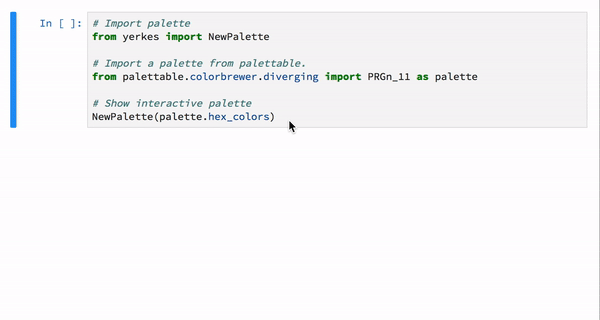
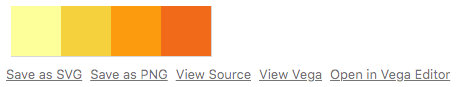
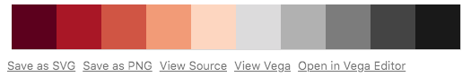

# Yerkes

**Interactive color palettes in Altair**

[](https://pypi.python.org/pypi/yerkes)
[](https://travis-ci.org/zsailer/yerkes)
[](https://yerkes.readthedocs.io/en/latest/?badge=latest)


* Free software: MIT license
* Documentation: https://yerkes.readthedocs.io.


Visualize color palettes interactively in Altair!.



## How to use.

The simplest use case is to pass the palette a list of colors.

1. Import `NewPalette` from Yerkes.
2. Pass a list of color-hex codes to `NewPalette`.

```python
from yerkes import NewPalette

colors = [
  '#FCFFA4',
  '#F6D746',
  '#FCA50A',
  '#F3761B',
]

NewPalette(colors)
```


You can also try exploring palettes from [palettable](https://jiffyclub.github.io/palettable/).

```python
# Import palette
from yerkes import NewPalette

# Import a palette from palettable.
from palettable.colorbrewer.diverging import RdGy_10 as palette

# Show interactive palette
NewPalette(palette.hex_colors)
```



## Install

Install from PyPI.

```
pip install yerkes
```

## Credits

This package was created with [Cookiecutter](https://github.com/audreyr/cookiecutter) and the [audreyr/cookiecutter-pypackage](https://github.com/audreyr/cookiecutter-pypackage) project template.
